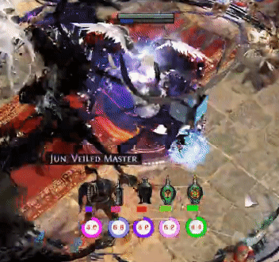

# DeadlyTrade Overhaul.

    

## Installation
| Download | Latest |
| ------ | ------ |
| Download latest release and unzip. It is portable. |  |
|Checking & Update Automatically when Launch. |Update notice panel is shown when update available.|

## Languages
* [C#, .Net Core/Web] - Front End, Web API
* [Cli] - Interop, Core API
* [C++] - Core

## DeadlyTrade Overhaul 1.4.0.7 version. Temporary version before new version release.

### 1.4.0.7 DeadlyTrade Temporary Released.

○ This deploying is a temporary version
because I'm having a long process of finalizing new versions with significant changes with new features.

I'm trying to release new version asap.
Thank you always all of you.

○ This temporary release modified only Ninja price function for Harvest league.

○ 이번 배포는 새로운 기능들과 함께 상당히 많은 변화가 있는
새로운 버전을 마무리하는 과정이 길어지고 있어서 임시로 배포드리는 버전입니다.

새로운 버전을 가능한한 빨리 마무리하기 위해 노력하고 있습니다.
모든분들께 감사드립니다.

○ 이 임시 배포는 수확 리그를 위한 닌자 가격 기능의 수정만 포함되어 있습니다.

Keep grinding~! ♡ cheers, gl&hf all of you. Thanks.

 데들리트레이드 1.4.0.7 임시 버전 릴리즈 안내 - Temporary version before new version release.")

[ Download Link ]

* Full Version :
https://github.com/DeadlyCrush/DeadlyTrade/releases/download/1.4.0.8/DeadlyTradeOverhaul_1.4.0.8.zip
* Update :
https://github.com/DeadlyCrush/DeadlyTrade/releases/download/1.4.0.8/DeadlyTrade_Update_1.4.0.8.zip
* Update will be automatically if you have previous version above 1.4.0.1
기존 사용자분들 중 1.4.0.1 버전 이상의 사용자는 자동 업데이트 됩니다.

## Work in progress - For 3.11 Season. (Temporary Added. 2020.06.06)
I'm prepare update focus to next league including support Vulkan & price check.
I will announce details soon. Thanks 😊. 

More Information : 

https://www.pathofexile.com/forum/view-thread/2785386 (https://poe.game.daum.net/forum/view-thread/2785386)

and 

https://discord.gg/Gd7MjCz #work-in-progress channel.

Stay healthy and have a nice day 😊

# DeadlyTrade Main Features and Useful Functions.
* Please check detailed Explanation in POE Forum : https://www.pathofexile.com/forum/view-thread/2785386

### Auto Detect.
* User's POE Client Path.
* Detect GGG Client & KAKAO Client.
* User's POE UI Language setting.
* User's Screen resolution.
* User's POE Flask and Skill key binding.
* All information auto change by detected UI Language : ENG/KOR

### Main HUD rework.
After you launch the addon, you should see the main HUD pop up in game. You can lock/unlock the UI location by pressing the Lock at the top right. The image above explains what each button does.

### Trade Notification
Provide clipboard parsing when Kakao user buying that can be useful for kakao user. Find item by position function can be useful for who struggle with other languages message not Eng. Also deadlytrade can parse and pop panel when trade whisper by ggg user even if kakao user set default trade message language to Korean.

Support Korean and English.You can customize notification panel buttons.
* Color Change : BUY/SELL
* Show Grid when Click Notification panel.
* Show current Ninja currency ratio.
* Convenience default button : Visit hideout, invite, trade request, kick/leave and etc...
* Can use user customize 7 buttons.

### Auto Grid Setting by User's screen resolution
Automatically detect and display the grid in the item window.

### Search Item by Position (X,Y)
You can use this button when you get a trading message from a Kakao user or from someone using a different language. You can input the coordinates in the trading message as shown below and find the item requested.

### Chat Scanner : Trade Channel
Allows you to scan the trade chat. Works when the trade chat channel is activated.

### Act Helper for Leveling, Quest line.
Act helper is especially useful when you want to reroll or speedrun at league start. It will tell you where to go for waypoints and every step from Act 1 to Act 10. You no longer have to alt tab to look at a leveling guide and you can use this for a faster playthrough.

### Check Ninja Currency & Simple Caclulator.
You can use this button to check poe.ninja prices and convert currency values.

### Annoint information rework.
You can get information about Oil Anointments for rings, amulets and maps. You can either put the oils yourself to see what enchant you get or you can search for it using the search bar.

### Region map search rework.
You can search maps by region using this button. If you have your stash open it will automatically search for the selected region/map.
- It is advised to use this feature with your stash open.
- Click a region to search all the maps in the region and display them on the list below.

### Atlas Overlay new feature added.

### New Flask image timer, skill timer ui changed.
With timer toggle buttons, you can turn flask timer (1,2,3,4,5) and skill timer (Q,W,E,R,T) on and off. Changes will be immediately applied after clicking the button. Automatically detect POE key bindings

### Chromatic Calculator
You can calculate how many chromatic orbs you will need on average in order to get the sockets you want using this tool.

## Settings
Use this button to access settings to change hot keys, customize buttons, and set flask times.

## Labyrinth Overlay
You can use this button to open up the lab overlay. You can choose which lab and press launch overlay to open that day’s lab with the data from poelab.com. You can then resize it the way you like.

## Information Overlay : Atlas, Syndicate, Incursion, Fossil
You can get information about as shown below.
You can change overlay image to your custom image in settings.

## Misc.
- CTRL+MOUSE WHEEL : Moving stash tab by Ctrl+Mouse Wheel

- Remaining Monster.
Remaining monsters count hotkey is F2 by default, and is configurable in the settings.
More than 50 monsters are displayed as 50+.
- 

- Someone entered.  ( hideout )
Automatic feature that works in the hideout.
When somebody enters the hideout, a panel with the character’s name is displayed for about a second, like the picture above.
It is more useful during a trade.
- 

- POE Command
Opens up the UI for some useful commands as you can see. You can toggle it on/off with this button.
- 

## Default Hot Keys (Can change in Settings)
- Hideout : F5
- Emergency : CTRL+SCACE
- Find item by Position (X,Y) : CTRL+P
- Monster Remaining : F2
- Syndicate Overlay : F3
- Incursion Overlay : F6
- Atlas, Pantheon Overlay : F7
- Flask & Skill Timer : Auto detect your In-Game Option.

## Performance
You can disable any feature you don’t want to use while launching the add-on and the app uses very little resources, around 50-80mb Ram which is around 1 tab in Chrome. It has no effect on GPU and even when receiving data from poe.ninja, the effects on the CPU usage is very minimal and will not cause any performance issues.

## FAQ
DeadlyTrade is made based on 1920×1080 Windows Fullscreen Path of Exile. You can find other resolution’s config files in the installation folder.

Does the trading UI work with Kakao Users? No, it does not. Unfortunately right now there is no way to read messages from Kakao Client users with an addon because of legal/ToS issues.

I am getting a warning when i try to install. Are you trying to hack my computer? No, we are not. To prevent that warning from popping up we need to buy a license, which costs a lot of money. You can run the files through an antivirus if you wish to be safe about it. (Which you should, never trust a stranger on the internet.)

I got a suggestion/problem, how can i contact you? You can contact us via discord and github. We would be happy to listen to you. https://discord.gg/Gd7MjCz

## History
- DeadlyTrade Overhaul Version Released Feb,2020
- DeadlyTrade Renewal Version Started Jan,2020
- DeadlyTrade Started and Sharing April,2019
- POEExileDirection coverted to DeadlyTrade in new empty Project 1year ago.
- MercuryTrdae(Exslims) All Korean UI&Functions Version Jun,2019 until Exslims no longer maintain officially.

### Behind...
It started from inspired Mercurytrade when I made and share Korean version of Mecurytrade. Addon name 'DeadlyTrade' also  inspired by 'MercuryTrade' including my respect to great exslims mercury trade ("Deadly"Crush + Mercury"Trade"). But All of my add-ons including this, DeadlyTrade, started empty handed, completely on my own and It comply with ggg's TOS.

I released DeadlyTrade beta version After the Mid-June, 2019 official launch of Kakao client. I forked and made Mercury Trade KOR version with Korean UI and every functions for Korean user and shared until great Exslims no longer maintain officially. I managed MercuryTrade KOR and Improving DeadlyTrade 0.1.0.1 over and over. And I prepared overhaul version after Exslim said officially that he will does not maintain.

## Join our community & Welcome Contributors

Welcome

    

All Exile~ and Developers.

## Let me know Any Bug, Any Suggestion
 

### Build Passing, License, Contributor etc...
I got "Build Passing" with Travis CI, AppVeyor and other Sites. Travis CI and the others are hosted, distributed continuous integration service used to build and test projects hosted at GitHub.
- Travis CI and the others are automatically detects when a commit has been made and pushed to a GitHub repository that is using their pipeline and each time this happens, it will try to build the project and run tests. Especially considering the increasing number of add-ons, this should have a positive effect for everyone.
- Github Actions CI Passed. Real-Time connected.
- AppVeyor CI Passed. Real-Time connected.
- Azure Pipelines Passed. Real-Time connected.
- Travis CI Passed. Real-Time connected.
- Addition 1: Added License and Contributor Covenant, so we can work together under the License MIT and Contributor Covenent.
- Addition 2: When downloading or launching the program, you might get some warnings from your security or anti-virus program caused by missing licenses and signatures. I will add an international signature to fix that. SSH Certification is accepted and is being prepared for Code Signing. It will be done before next update.

### Issue Tracking
- Added Zap auto trigger that pulling new github issue to our Jira agile board for effective maintenance.

## Special Thanks to
- Since the Korean launch of Path Of Exile, Localizing existing add-on programs affected me in many aspects. 
MercuryTrade, TradeMacro, POE Compass, Lab Compass, TradeForPoe, CurrencyCop, Exilence and many more...
All are such an amazing and inspiring examples that I can't thank enough.

## Work in progress
- Price checking throgh the pathofexile trade.
- Set priority User request and will be reflect.
- English will be default UI from now on.
- Separating Korean and English menu and alert message language resources.
- Adding user suggestions' function to reflect by priority.
- Continuing development of core new features that were already planned.

## Goal
- Useful and Convenient Addon for Path of Exile User

## Contact
Private >
- Blog -https://deadlytrade.tistory.com/ https://blog.naver.com/eocsdev2
- Twitter - https://twitter.com/crush_deadly
- Facebook - https://www.facebook.com/deadlycrush.kor
- Reddit - https://www.reddit.com/user/DeadlyCrush
- Discord - DeadlyCrush#7202

Funny Project >
- GitHub - https://github.com/DeadlyCrush
- Azure - https://dev.azure.com/DeadlyCrush/

Media >
- Twitch - https://www.twitch.tv/deadlycrush
- Youtube - https://www.youtube.com/c/DeadlyCrush

DeadlyTrade / Deadly KOR Team >
- Discord - (ENG) https://discord.gg/Gd7MjCz (KOR) https://discord.gg/ryjUA7r
- Site - https://www.jumpleasure.me/deadlytrade
- KAKAO Open Talk - https://open.kakao.com/o/gylOSztb

## Download Status (Real-Time)

   

| DeadlyTrade Repository. | Download |
| ------ | ------ |
|( Repository moved. ) 2020.02.16 ~ Now.| |
| DeadlyTrade 1.0.0.0 Version. ~ 2020.02.15 |  |

# Thank you all. Good Luck Exile~!
Please let me know about any bugs you encounter or if you have any suggestions.
Thank you for your interest and support.

## Added - How to fix : Error by high security protection
Hello, this is DeadlyCursh.
I received a few bug-report and I was checked and figured out those case with reported user's log and configuration. Thank you for all users.

If you have repeated error please download "DeadlySecurityChecked_Dll.zip (Size 1.62Mb)" and unzip files.
And overwrite that to installed folder. download "DeadlySecurityChecked_exe_config.zip (Size 1.87Mb)" that contains lastest exe and defualt configuration file if you necessory.

exe or dll could be deleted by high security protection recently. So if in this case you should temporary pause virus protection program when download/extract. After that re-check downloaded files whether virus detected or not.

Thank you all. Exile. gl & hf.

reference. >
"When downloading or launching the program, you might get some warnings from your security or anti-virus program caused by missing licenses and signatures. I will add an international signature to fix that. SSH Certification is accepted and is being prepared for Code Signing. It will be done before next update."

Update server, agile board, build passing, issue tracking and etc. all use my personal servers. Also international certification is delaying as it is conducted as an individual. I will proceed international certification ASAP.

## Added - 2020.04.13 Personal Message for users.

I will restart maintenance add-on from now on.
I have been confused last two weeks about improve & sharing this add-on. So, I took a break time with my family.

Fortunately, I feel much better than lask week. This add-on that hobby for me (like a I was deployed WOW original add-on before.) so I didnt not code professional like a my IT working field before overhauled.

But, It's small ugly add-on was growed up with yours, and I feel somthing like duty whatever when it's growing up.

Anyway I will keep maintenance, improvement this add-on without consider that duty, user's wrong complain and the other weird users.

Thanks for waiting and patience. GL & HF
Stay healthy and have a nice day!

## Added - 2020.05.02 Update server Fixed.

### Update server Down (13:00 +- 4hours)
I＇m checking about DeadlyTrade launch issue because there is a problem with the personal server that used for update. Please understand it may delayed that it is hard to figure out whether this issue with the service provider or other problem, because it is weekend.

I＇ll let you know asap the issue＇s causing confirmed or issue is fixed.
In addition, if the issue is continue, I will release earlier that scheduled update at sunday, for receive updates from other my personal servers. Thank you.

### Update server Fixed (15:30 +- 10min. )
You can launchDeadlyTrade now. Please understand it was delayed that it was hard to figure out whether this issue with the service provider or other problem, because it is weekend.

DeadlyTrade available normally now. Thank you.

